# Заметки о fpc/lazarus
#### *Вместо предисловия*

Лет 7 назад, когда появились мысли перевести кодинг на Паскале из любимого хобби в средство зарабатывания денег, я стал задумываться о лицензионной чистоте своих программ. 

Поскольку я  - не профессиональный программер, то мысли о покупке Дельфи пришлось отмести сразу. К тому же, отсутствие кроссплатформенности и безумная маркетинговая политика компаний-владельцев Дельфи совсем не внушали оптимизма и отбивали всякую охоту вкладывать туда деньги.

ИМХО, как раз к этому времени фпц/лазарус из сырого опенсорсного проекта кучки энтузиастов стал превращаться во вполне серьезный инструмент. Безусловно, в некоторых моментах Лазарусу до Дельфей еще очень далеко (например, отладчик у последнего на порядок удобнее и функциональнее). Зато редактор кода Лазаруса с его подсветкой и другими плюшками оставляет Дельфи далеко позади. К тому же, Lazarus АБСОЛЮТНО БЕСПЛАТЕН. И кроссплатформенный. К тому же баги в нем правятся, если не ежечасно, то точно ежедневно.

Но, как и всякий опенсорс, фпц/лазарус требует ручной сборнки и тюнинга. А внятной литературы по нему очень мало. Поэтому я решил выкладывать в виде статей свой опыт их использования. 

Буду рад, если кому-нибудь этот материал окажет помощь.

Zoltanleo, aka Док (2021г.)

## Сборка FPC/Lazarus. 

### Сборка с помощью bat-файлов

Coming soon ...

### Сборка с помощью fpcupdeluxe

Coming soon ...

## Кросскомпиляция в FPC

### Установка кросскомпилятора 

Будем считать, что компилятор и лазарь уже установлены при помощи именно [fpcupdeluxe](https://github.com/LongDirtyAnimAlf/fpcupdeluxe/releases) и в поле "set install path" указана папка с установленными фпц/лазарем

Переходим на вкладку "cross"

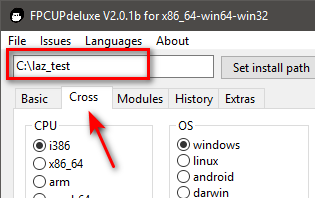

Выбираем разрядность процессора и ОСь.

*Обратите внимание*: можно собирать кросскомпилятор под процессор другой разрядности на текущей платформе. Главное помнить, какой разрядности у вас запущен fpcupdeluxe (указанная на скрине софтинка собирает под винду 64-битный фпц, значит "кроссплатформой" под винду будет сборка компилятора x32/i386 и т.д.)

#### Windows

Выбираем соответственно `CPU=i386` и `OS=Windows`, и жмем "Install compiler". После немного странных предупреждений

 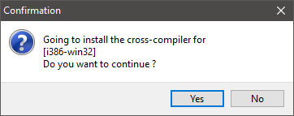

компилятор x32 ставится без дополнительных телодвижений.

*Примечание:* как сделать режим сборки исполняемого файла под x32, смотри в [следующей главе](###Режимы-сборки-для-кросскомпилятора).

#### Linux

Поскольку сборки кросскомпилятора под i386 и amd64 идентичны, опишу процесс для последнего из перечисленных.

Выбираем опции `CPU=x86_64` и `OS=linux`, жмем "Install compiler". Получаем два немного странных уведомления

  

и ждем, пока софтинка не сообщит нам, что у него нет в данный момент инструмента для сборки кросскомпилятора и не предложит их нам немедленно скачать 

Соглашаемся, наблюдая процесс их загрузки и распаковки

и терпеливо дожидаемся окончания сборки

*Примечание*: как сделать режим сборки исполняемого файла под i386/amd64, смотри в [следующей главе](###Режимы-сборки-для-кросскомпилятора).

#### Darwin

Поскольку для тестов своих проектов под макось я использую ее хакинтошные сборки в виртуалке, которые задействуют процессор x86_64, то здесь опишу процесс сборки кросскомпилятора этой архитектуры.

Выбираем `CPU=x86_64` и `OS=Darwin`, жмем "Install compiler". Соглашаемся с уже привычными нам уведомлениями

 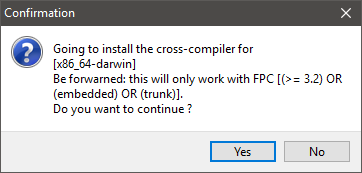

и ждем, пока софтина опять не предупредит нас об отсутствующем инструментарии 

 

Соглашаемся, наблюдая процесс загрузки и распаковки инструментария

Терпеливо наблюдаем за окончанием процесса

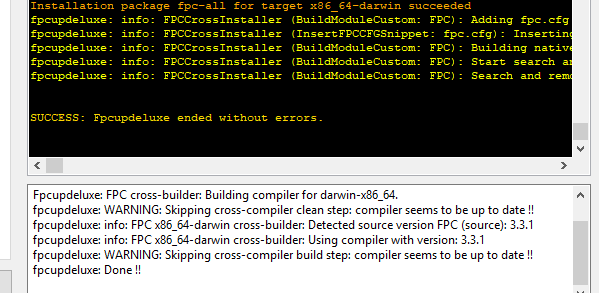

*Примечание*: как сделать режим сборки исполняемого файла под x86-64, смотри в [следующей главе](###Режимы-сборки-для-кросскомпилятора).

### Режимы сборки для кросскомпилятора

Чтобы собирать исполняемые файлы под разные платформы при помощи кросскомпилятора(ов), необходимо настроить соответствующие режимы сборок в проекте. Для этого открываем Лазарус, создаем новый проект, и открываем свойства проекта

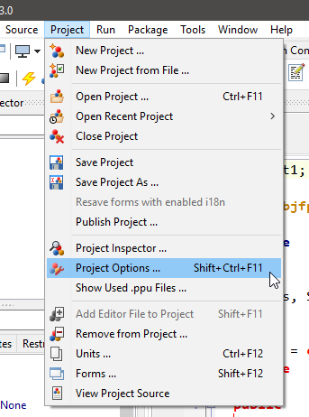

В открывшемся дереве находим "Compiler options" и переходим к настройке режимов сборки ("Build modes"), нажав на кнопку с троеточием

По умолчанию Лазарь имеет один режим сборки ("Default"), который собирает исполняемый файл с отладочной информацией (остальные детали в данный момент несущественны).

*При этом исполняемый файл будет соответствовать разрядности компилятора (как мы помним из предыдущего топика, разрядность компилятора будет соответствовать разрядности fpcupdeluxe, при помощи которого его собрали).*

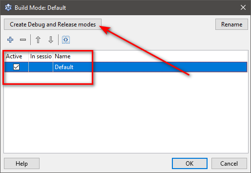 

Жмем на кнопку "Create Debug and Release modes", чтобы создать отдельно режимы отладки и релизных сборок

Теперь можно удалить режим "Default" и добавить еще пару-тройку релизных режимов под наши нужды, не забыв их соответствущим образом переименовать

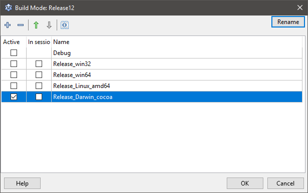

Теперь закрываем окно и идем настраивать наши режимы.

Переходим в дереве настроек к пункту "Config and Target"

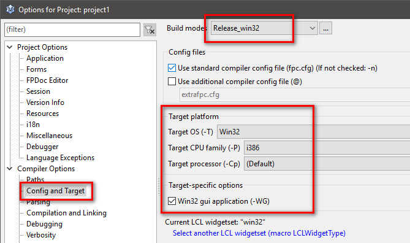

Последовательно выбирая в выпадающем списке "Build modes" заданные режимы сборки, задаем для каждого из них соответствующие настройки:

| Режим                | OS     | CPU    | Примечание                                                   |
| -------------------- | ------ | ------ | ------------------------------------------------------------ |
| Debug                |        |        | настройки по умолчанию не трогаем! (если только точно не знаем что делаем) |
| Release_win32        | win32  | i386   | галочку "Win32 GUI application" не снимаем!                  |
| Release_win64        | win64  | x86_64 | галочку "Win32 GUI application" не снимаем!                  |
| Release_linux_i386   | Linux  | i386   | галочку "Win32 GUI application" не снимаем!                  |
| Release_linux_amd64  | Linux  | x86_64 | галочку "Win32 GUI application" не снимаем!                  |
| Release_Darwin_Cocoa | Darwin | x86_64 | галочку "Win32 GUI application" снимаем обязательно! См. примечание |

*Примечание*: поскольку в каждой ОСи для отображения контролов на форме(ах) используются различные виджетсеты, то для "своей" Макоси (в [предыдущей главе](####Darwin) я писал, что использую Darwin с виджетами Cocoa) необходимы дополнительные настройки.

Необходимо снять галочку с "Win32 GUI application"

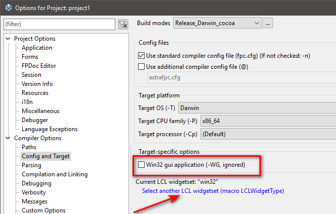

и нажать на ссылку "Select another widgetset" (или перейти в дереве проекта к пункту "Additions and Overrides")

 

В выпадающем списке "SetLCLWidgetType" выбрать пункт "Value "Cocoa" и удостовериться, что напротив этого режима сборки стоит отметка

и закрыть диалоговое окно.

Но это еще не все ...

Если начать собирать проект в разных режимах, то все исполняемые файлы будут компилиться под одним именем и в одной папке, при этом они будут практически неотличимы друг от друга. Чтобы этого избежать, я вношу еще несколько изменений в свойства проекта, используя макросы IDE.

Допустим, файл моего проекта имеет название "fbutil_wrapper.lpi". Для debug-режима я указываю для выходного файла (поле "Target file name") значение: `debug\$NameOnly($(ProjFile))-debug`

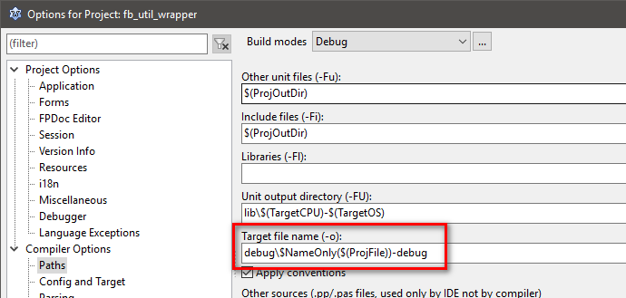

а для "релизных" сборок значение: `release\$NameOnly($(ProjFile))-$(TargetCPU)-$(TargetOS)`

В результате, отладочные файлы лежат в отдельной папке, релизные - в отдельной

### Сборка приложений кросскомпилятором

Для быстрого выбора режима сборки можно воспользоваться тулбаром или соответствующим пунктом меню. Можно собирать файлы каждый по отдельности, либо скопом

   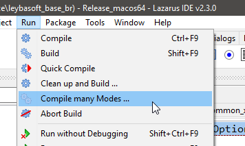

**Важный момент(!)**: если сборка идет под другую платформу, то нельзя собирать/компилить проект при помощи `<F9>` - получите ошибку о невозможности запустить исполняемый файл. Необходимо собирать/компилить исполняемый файл при помощи (если по дефолту) `<Shift>+<F9>`/`<Ctrl>+<F9>`

Надеюсь этот некраткий мануал кому-то поможет :)