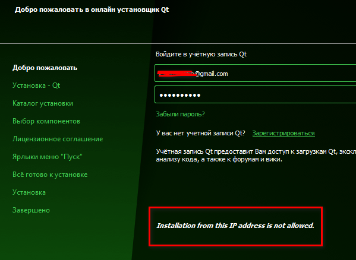

# Заметки о fpc/lazarus
#### *Вместо предисловия*

Лет 7 назад, когда появились мысли превратить кодинг на Паскале из любимого хобби в средство зарабатывания денег, я стал задумываться о лицензионной чистоте своих программ. 

Поскольку я  - не профессиональный программер, то мысли о покупке Дельфи пришлось отмести сразу. К тому же, отсутствие кроссплатформенности и безумная маркетинговая политика компаний-владельцев Дельфи совсем не внушали оптимизма и отбивали всякую охоту вкладывать туда деньги.

ИМХО, как раз к этому времени фпц/лазарус из сырого опенсорсного проекта кучки энтузиастов стал превращаться во вполне серьезный инструмент. Безусловно, в некоторых моментах Лазарусу до Дельфей еще очень далеко (например, отладчик у последнего на порядок удобнее и функциональнее). Зато редактор кода Лазаруса с его подсветкой и другими плюшками оставляет Дельфи далеко позади. К тому же, Lazarus АБСОЛЮТНО БЕСПЛАТЕН. И кроссплатформенный. И баги в нем правятся, если не ежечасно, то точно ежедневно.

Но, как и всякий опенсорс, фпц/лазарус требует ручной сборки и тюнинга. А внятной литературы по нему очень мало. Поэтому я решил выкладывать в виде статей свой опыт их использования. 

Буду рад, если кому-нибудь этот материал окажет помощь.


Zoltanleo, aka Док (2021г.)


## Оглавление

[Сборка FPC/Lazarus](#building_fpc_lazarus)
 * [Сборка с помощью bat-файлов](#building_via_batch_files)
 * [Сборка с помощью fpcupdeluxe](#building_via_fpcupdeluxe)
 
[Установка Lazarus c QT-интерфейсом](#installing_qt_lazarus)
 * [Windows](#qt_lazarus_windows)
 * [Linux](#qt_lazarus_linux)

[Кросскомпиляция в FPC](#crosscompilling_fpc)
 * [Установка кросскомпилятора](#crosscompiler_install)
   + [Windows](#crosscompiler_install_win)
   + [Linux](#crosscompiler_install_linux)
   + [Darwin](#crosscompiler_install_darwin)
 * [Режимы сборки для кросскомпилятора](#crosscompilling_build_mode)
 * [Сборка приложений кросскомпилятором](#crosscompilling_building)


## Сборка FPC/Lazarus. <a name="building_fpc_lazarus"></a> 

### Сборка с помощью bat-файлов <a name="building_via_batch_files"></a>

Coming soon ...

### Сборка с помощью fpcupdeluxe <a name="building_via_fpcupdeluxe"></a>

Coming soon ...

## Установка Lazarus c QT-интерфейсом <a name="installing_qt_lazarus"></a>

По умолчанию Лазарус устанавливается с оконным интерфейсом Win32. Чтобы собрать IDE c qt-интерфейсом, необходимо предварительно скопилировать библиотеку (dll/so), при помощи которой будет осуществлена сборка среды. Кроме того, под ОС Linux необходимо, чтобы qt-интерфейс поддерживался рабочим столом (например, KDE Plasma).

#### Windows <a name="qt_lazarus_windows"></a>

Для начала нам понадобятся бинарные файлы и библиотеки qt-фреймворка. Удобнее всего их получить при помощи [online-](https://www.qt.io/download-qt-installer) или [offline-](https://www.qt.io/offline-installers)инсталляторов.

При переходе на страницу загрузки по умолчанию предлагается online-инсталлятор.


Если установка бинарников будет осуществляться посредством online-инсталлятора, то потребуется учетка с сайта qt-creator. Поэтому позаботьтесь об этом заранее.


> *Для аудитории РФ:* на момент написания статьи все российские IP банятся для скачивания и установки. Поэтому, если при попытке перейти на страницу загрузки вы видите вот это безобразие


> смело используйте прокси. Но и это еще не все 

Вы также не сможете использовать и offline-инсталлятор, потому что он также будет вас банить



Чтобы не мучиться с регистрацией и/или обходом дурацкого блокировщика IP:
- скачиваем offline-инсталлятор по ссылке выше (можно воспользоваться прямой ссылкой и использовать сторонний загрузчик https://mirror.netcologne.de/qtproject/archive/qt/5.12/5.12.12/qt-opensource-windows-x86-5.12.12.exe).
- отключаем интернет и запускаем инсталлятор
- инсталлятор позволяет перейти уже непосредственно к установке желаемого


 
- задаем каталог установки


- помечаем в разделе ***"Qt x.x.x"*** пункт *"MinGWх.х.х win64"*(для win32 пометьте вместо него *"MinGWх.х.х. win32"*) и в разделе ***"Developer and Designer  Tools"*** пункты *"MinGWх.х.х win64"*(для win32 пометьте вместо него *"MinGWх.х.х. win32"*) и *"Qt Creator x.x.x. CDB Debugger Support"* 


- Дальше пошагово устанавливаем бинарники и библиотеки, на последней странице снимаем галочку, чтобы не запускать Qt creator, и закрываем инсталлятор


Теперь мы получаем набор бинарников и библиотек Qt-фреймворка (у меня они установились сюда): 
```bash
c:\Qt\5.12.12\mingw73_64\bin 
c:\Qt\Tools\mingw730_64\bin
c:\Qt\Tools\QtCreator\bin
```

Чтобы дальше работать из консоли с утилитами, необходимо добавить их в переменные окружения либо через реестр (я сделал так), либо через консоль
```bash
set PATH=c:\Qt\5.12.12\mingw73_64\bin;c:\Qt\Tools\mingw730_64\bin;c:\Qt\Tools\QtCreator\bin;%PATH%
```
> ***Примечание:*** *если во время сборки dll вы получаете вот такое сообщение*
```bash
Qt5Pas_resource.rc:1: windows.h: No such file or directory
windres: Qt5Pas_resource.rc:12: syntax error
windres: preprocessing failed.
mingw32-make: *** [Makefile:1463: tmp/Qt5Pas_resource_res.o] Error 1
```
> *значит используется, скорее всего, утилита *windres.exe* ***не из набора*** установленного Qt (у меня она лежит здесь c:\Qt\Tools\mingw730_64\bin), а из другого каталога (например, каталог с компилятором *fpc.exe*/*ppcx.exe* также содержит этот файл). Это следует учесть, когда будете указывать пути. От этого зависит, где сначала компилятор будет искать эту утилиту.*

Итак, будем считать, что вся предварительная подготовка завершена(у вас уже должен быть установлен компилятор и git-клиент). 

Качаем исходный код Лазаруса
```bash
C:\Users\leyba>md c:\laz_qt
C:\Users\leyba>cd c:\laz_qt
c:\laz_qt>git clone https://gitlab.com/freepascal.org/lazarus/lazarus.git
```
Далее переходим в папку с исходным кодом Qt5
```bash
c:\laz_qt>cd c:\laz_qt\lazarus\lcl\interfaces\qt5\cbindings\
```

Проверяем, все ли нужные нам переменные окружения заданы корректно
```bash
c:\laz_qt\lazarus\lcl\interfaces\qt5\cbindings>qmake -query
QT_SYSROOT:
QT_INSTALL_PREFIX:C:/Qt/5.12.12/mingw73_64
QT_INSTALL_ARCHDATA:C:/Qt/5.12.12/mingw73_64
QT_INSTALL_DATA:C:/Qt/5.12.12/mingw73_64
QT_INSTALL_DOCS:C:/Qt/Docs/Qt-5.12.12
QT_INSTALL_HEADERS:C:/Qt/5.12.12/mingw73_64/include
QT_INSTALL_LIBS:C:/Qt/5.12.12/mingw73_64/lib
QT_INSTALL_LIBEXECS:C:/Qt/5.12.12/mingw73_64/bin
QT_INSTALL_BINS:C:/Qt/5.12.12/mingw73_64/bin
QT_INSTALL_TESTS:C:/Qt/5.12.12/mingw73_64/tests
QT_INSTALL_PLUGINS:C:/Qt/5.12.12/mingw73_64/plugins
QT_INSTALL_IMPORTS:C:/Qt/5.12.12/mingw73_64/imports
QT_INSTALL_QML:C:/Qt/5.12.12/mingw73_64/qml
QT_INSTALL_TRANSLATIONS:C:/Qt/5.12.12/mingw73_64/translations
QT_INSTALL_CONFIGURATION:
QT_INSTALL_EXAMPLES:C:/Qt/Examples/Qt-5.12.12
QT_INSTALL_DEMOS:C:/Qt/Examples/Qt-5.12.12
QT_HOST_PREFIX:C:/Qt/5.12.12/mingw73_64
QT_HOST_DATA:C:/Qt/5.12.12/mingw73_64
QT_HOST_BINS:C:/Qt/5.12.12/mingw73_64/bin
QT_HOST_LIBS:C:/Qt/5.12.12/mingw73_64/lib
QMAKE_SPEC:win32-g++
QMAKE_XSPEC:win32-g++
QMAKE_VERSION:3.1
QT_VERSION:5.12.12
```

Если вывод завершается какой-либо ошибкой, то сделайте ревизию путей и переопределите их.
 
Если мы получаем аналогичный вывод, то переходим к созданию *Makefile* для со сценарием сборки:
```bash
c:\laz_qt\lazarus\lcl\interfaces\qt5\cbindings>qmake
Info: creating stash file C:\laz_qt\lazarus\lcl\interfaces\qt5\cbindings\.qmake.stash
Project MESSAGE: Note: This binding version was generated for Qt 5.6.1. Current Qt is 5.12.12
Project MESSAGE: Qt documents binary compatibility in each Version Change Note: http://qt.nokia.com/developer/changes
Project MESSAGE: Pascal Qt Interface for binding platform: MSWINDOWS
Project MESSAGE: Install location: C:/Qt5/5.12.12/mingw73_64/bin
```

Теперь можно приступить к сборке Qt5-библиотеки. Запускаем длительный процесс:
```bash
c:\laz_qt\lazarus\lcl\interfaces\qt5\cbindings>mingw32-make
```
и идем пить кофе ... :) 

Результатом будет создание ***Qt5Pas1.dll*** в этом же каталоге, неоходимого для сборки Лазаруса с qt-интерфейсом.

Чтобы не копировать файлы в корень лазаруса, добавим к путям (в реестре или в консоли) эту папку способом, описанным выше.

Теперь приступаем непосредственно к сборке Лазаруса:
```bash
c:\laz_qt\lazarus\lcl\interfaces\qt5\cbindings>cd c:\laz_qt\lazarus
c:\laz_qt\lazarus> make bigide LCL_PLATFORM=qt5
```

Результатом будет создание Лазаруса с интерфейсом qt


#### Linux <a name="qt_lazarus_linux"></a>

Собрать лазарус-qt для Линукса проще всего, если окружение рабочего стола будет KDE Plasma (например, он идет в поставке к Debian, Kubuntu, Open SUSE). 

Я буду использовать для описания процесса клон Debian ОС Kubuntu.

Установка в Linux на порядок проще, чем в Windows. Будем считать, что у вас уже установлен компилятор и git. 

Скачиваем исходный код Lazarus и переходим в папку с qt5
```bash
$: md ~/laz_qt
$: cd ~/laz_qt
$: git clone https://gitlab.com/freepascal.org/lazarus/lazarus.git
$: cd ~/laz_qt/lazarus/lcl/interfaces/qt5/cbindings
```
Проверяем, установлены ли у нас необходимые пакеты:
```bash
$: qmake -query
```
Если получаем сообщение
```bash
bash: qmake: command not found
```
значит этого пакета у нас нет и его надо установить:
```bash
$: sudo apt install qt5-qmake
```

Снова пытаемся запустить qt-компилятор:
```bash
$:qmake
```

Если получаем ошибку:
```bash
"Project ERROR: Unknown module(s) in QT: core gui network printsupport x11extras"
```
значит нам не хватает еще несколько qt-модулей. Смотрим табличку (взято [отсюда](https://webhamster.ru/mytetrashare/index/mtb0/1620975455yvmf403xxv)):

|Qt module|dev package|lib package|
|------|------|------|
|bluetooth|qtconnectivity5-dev|libqt5bluetooth5|
|concurrent|qtbase5-dev|libqt5concurrent5|
|connectivity|qtmobility-dev|libqtconnectivity1|
|contacts|qtmobility-dev|libqt5contacts5|
|core|qtbase5-dev|libqt5core5a|
|dbus|qtbase5-dev|libqt5dbus5|
|designer|qttools5-dev|libqt5designer5|
|designercomponents|qttools5-dev|libqt5designercomponents5|
|feedback|qtmobility-dev|libqt5feedback5|
|gallery|qtmobility-dev|libqtgallery1|
|gui|qtbase5-dev|libqt5gui5|
|help|qttools5-dev|libqt5help5|
|location|qtmobility-dev|libqt5location5|
|multimedia|qtmultimedia5-dev|libqt5multimedia5|
|multimediakit|qtmobility-dev|libqtmultimediakit1|
|network|qtbase5-dev|libqt5network5|
|networkauth|libqt5networkauth5-dev|libqt5networkauth5|
|nfc|qtconnectivity5-dev|libqt5nfc5|
|opengl|libqt5opengl5-dev|libqt5opengl5|
|organizer|qtmobility-dev|libqt5organizer5|
|positioning|qtpositioning5-dev|libqt5positioning5|
|printsupport|qtbase5-dev|libqt5printsupport5|
|publishsubscribe|qtmobility-dev|libqt5publishsubscribe5|
|qml|qtdeclarative5-dev|libqt5qml5|
|quick|qtdeclarative5-dev|libqt5quick5|
|quickparticles|qtdeclarative5-dev|libqt5quickparticles5|
|quicktest|qtdeclarative5-dev|libqt5quicktest5|
|quickwidgets|qtdeclarative5-dev|libqt5quickwidgets5|
|script|qtscript5-dev|libqt5script5|
|scripttools|qtscript5-dev|libqt5scripttools5|
|sensors|qtmobility-dev, libqt5sensors5-dev|libqt5sensors5|
|serialport|libqt5serialport5-dev|libqt5serialport5|
|serviceframework|qtmobility-dev|libqt5serviceframework5|
|sql|qtbase5-dev|libqt5sql5|
|svg|libqt5svg5-dev|libqt5svg5|
|systeminfo|qtmobility-dev|libqt5systeminfo5|
|test|qtbase5-dev|libqt5test5|
|uitools|qttools5-dev|?|
|versit|qtmobility-dev|libqtversit1|
|webchannel|?|?|
|webkit|libqt5webkit5-dev|libqt5webkit5|
|websockets|libqt5websockets5-dev|libqt5websockets5|
|widgets|qtbase5-dev|libqt5widgets5|
|x11extras|libqt5x11extras5-dev|libqt5x11extras5|
|xml|qtbase5-dev|libqt5xml5|
|xmlpatterns|libqt5xmlpatterns5-dev|libqt5xmlpatterns5|

В нашем случае случае это модули: 
- core (qtbase5-dev)
- gui (qtbase5-dev)
- network (qtbase5-dev)
- printsupport (qtbase5-dev)
- x11extras (libqt5x11extras5-dev)

которые находятся в пакетах *qtbase5-dev* и *libqt5x11extras5-dev*. Ставим их:

```bash
$: sudo apt install qtbase5-dev libqt5x11extras5-dev
```

Теперь пробуем еще раз:
```bash
$: qmake

Project MESSAGE: Note: This binding version was generated for Qt 5.6.1. Current Qt is 5.15.3
Project MESSAGE: Qt documents binary compatibility in each Version Change Note: http://qt.nokia.com/developer/changes
Project MESSAGE: Adding x11extras for XOrg platform.
Project MESSAGE: Pascal Qt Interface for binding platform: BINUX
Project MESSAGE: Install location: /usr/lib/x86_64-linux-gnu
```

Результатом будет создание Makefile. Теперь пытаемся собрать библиотеки
```bash
$: make
```
Если получаем сообщение:
```bash
make: *** No targets specified and no makefile found.  Stop.
```
значит Makefile у нас так и не собрался. Повторяем процесс.

Если все в порядке, то начнется длительный процесс компиляции библиотек, который закончится выводом:
```bash
ln -s libQt5Pas.so.1.2.10 libQt5Pas.so
ln -s libQt5Pas.so.1.2.10 libQt5Pas.so.1
ln -s libQt5Pas.so.1.2.10 libQt5Pas.so.1.2
```

Теперь можно установить их в системные папки
```bash
$: sudo make install

/usr/lib/qt5/bin/qmake -install qinstall -exe libQt5Pas.so.1.2.10 /usr/lib/x86_64-linux-gnu/libQt5Pas.so.1.2.10
strip --strip-unneeded /usr/lib/x86_64-linux-gnu/libQt5Pas.so.1.2.10
ln -f -s libQt5Pas.so.1.2.10 /usr/lib/x86_64-linux-gnu/libQt5Pas.so
ln -f -s libQt5Pas.so.1.2.10 /usr/lib/x86_64-linux-gnu/libQt5Pas.so.1
ln -f -s libQt5Pas.so.1.2.10 /usr/lib/x86_64-linux-gnu/libQt5Pas.so.1.2
```

Теперь собираем Лазарус 
```bash
$: cd ~/laz_qt/lazarus
$: make bigide
```

Результат:


## Кросскомпиляция в FPC <a name="crosscompilling_fpc"></a>

### Установка кросскомпилятора <a name="crosscompiler_install"></a> 

Будем считать, что компилятор и лазарь уже установлены при помощи именно [fpcupdeluxe](https://github.com/LongDirtyAnimAlf/fpcupdeluxe/releases) и в поле "set install path" указана папка с установленными фпц/лазарем

Переходим на вкладку "cross"


Выбираем разрядность процессора и ОСь.

> *Обратите внимание*: можно собирать кросскомпилятор под процессор другой разрядности на текущей платформе. Главное помнить, какой разрядности у вас запущен fpcupdeluxe (указанная на скрине софтинка собирает под винду 64-битный фпц, значит "кроссплатформой" под винду будет сборка компилятора x32/i386 и т.д.)


#### Windows <a name="crosscompiler_install_win"></a>

Выбираем соответственно `CPU=i386` и `OS=Windows`, и жмем "Install compiler". После немного странных предупреждений

 

компилятор x32 ставится без дополнительных телодвижений.


> *Примечание:* как сделать режим сборки исполняемого файла под x32, смотри в [следующей главе](#Режимы-сборки-для-кросскомпилятора).


#### Linux <a name="crosscompiler_install_linux"></a>

Поскольку сборки кросскомпилятора под i386 и amd64 идентичны, опишу процесс для последнего из перечисленных.

Выбираем опции `CPU=x86_64` и `OS=linux`, жмем "Install compiler". Получаем два немного странных уведомления

  

и ждем, пока софтинка не сообщит нам, что у него нет в данный момент инструмента для сборки кросскомпилятора и не предложит их нам немедленно скачать 


Соглашаемся, наблюдая процесс их загрузки и распаковки


и терпеливо дожидаемся окончания сборки


> *Примечание*: как сделать режим сборки исполняемого файла под i386/amd64, смотри в [следующей главе](#Режимы-сборки-для-кросскомпилятора).


#### Darwin <a name="crosscompiler_install_darwin"></a>

Поскольку для тестов своих проектов под макось я использую ее хакинтошные сборки в виртуалке, которые задействуют процессор x86_64, то здесь опишу процесс сборки кросскомпилятора этой архитектуры.

Выбираем `CPU=x86_64` и `OS=Darwin`, жмем "Install compiler". Соглашаемся с уже привычными нам уведомлениями

 


и ждем, пока софтина опять не предупредит нас об отсутствующем инструментарии 

 


Соглашаемся, наблюдая процесс загрузки и распаковки инструментария


Терпеливо наблюдаем за окончанием процесса


> *Примечание*: как сделать режим сборки исполняемого файла под x86-64, смотри в [следующей главе](#Режимы-сборки-для-кросскомпилятора).


### Режимы сборки для кросскомпилятора <a name="crosscompilling_build_mode"></a>

Чтобы собирать исполняемые файлы под разные платформы при помощи кросскомпилятора(ов), необходимо настроить соответствующие режимы сборок в проекте. Для этого открываем Лазарус, создаем новый проект, и открываем свойства проекта


В открывшемся дереве находим "Compiler options" и переходим к настройке режимов сборки ("Build modes"), нажав на кнопку с троеточием


По умолчанию Лазарь имеет один режим сборки ("Default"), который собирает исполняемый файл с отладочной информацией (остальные детали в данный момент несущественны).

> *При этом исполняемый файл в режиме "Default" будет соответствовать разрядности компилятора (как мы помним из предыдущей главы, разрядность компилятора будет соответствовать разрядности fpcupdeluxe, при помощи которого его собрали).*

 

Жмем на кнопку "Create Debug and Release modes", чтобы создать отдельно режимы отладки и релизных сборок


Теперь можно удалить режим "Default" и добавить еще пару-тройку релизных режимов под наши нужды, не забыв их соответствущим образом переименовать


Теперь закрываем окно и идем настраивать наши режимы.

Переходим в дереве настроек к пункту "Config and Target"


Последовательно выбирая в выпадающем списке "Build modes" заданные режимы сборки, задаем для каждого из них соответствующие настройки:


| Режим                | OS     | CPU    | Примечание                                                   |
| -------------------- | ------ | ------ | ------------------------------------------------------------ |
| Debug                |        |        | настройки по умолчанию не трогаем! (если только точно не знаем что делаем) |
| Release_win32        | win32  | i386   | галочку "Win32 GUI application" не снимаем!                  |
| Release_win64        | win64  | x86_64 | галочку "Win32 GUI application" не снимаем!                  |
| Release_linux_i386   | Linux  | i386   | галочку "Win32 GUI application" не снимаем!                  |
| Release_linux_amd64  | Linux  | x86_64 | галочку "Win32 GUI application" не снимаем!                  |
| Release_Darwin_Cocoa | Darwin | x86_64 | галочку "Win32 GUI application" снимаем обязательно! См. примечание |

> *Примечание*: поскольку в каждой ОСи для отображения контролов на форме(ах) используются различные виджетсеты, то для "своей" Макоси (в [предыдущей главе](#Darwin) я писал, что использую Darwin с виджетами Cocoa) необходимы дополнительные настройки.

Необходимо снять галочку с "Win32 GUI application"


и нажать на ссылку "Select another widgetset" (или перейти в дереве проекта к пункту "Additions and Overrides")

 

В выпадающем списке "SetLCLWidgetType" выбрать пункт "Value "Cocoa" и удостовериться, что напротив этого режима сборки стоит отметка


и закрыть диалоговое окно.

Но это еще не все ...

Если начать собирать проект в разных режимах, то все исполняемые файлы будут компилиться под одним именем и в одной папке, при этом они будут практически неотличимы друг от друга. Чтобы этого избежать, я вношу еще несколько изменений в свойства проекта, используя макросы IDE.

Допустим, файл моего проекта имеет название "fbutil_wrapper.lpi". Для debug-режима я указываю для выходного файла (поле "Target file name") значение: `debug\$NameOnly($(ProjFile))-debug`


а для "релизных" сборок значение: `release\$NameOnly($(ProjFile))-$(TargetCPU)-$(TargetOS)`


В результате, отладочные файлы лежат в отдельной папке, релизные - в отдельной


### Сборка приложений кросскомпилятором <a name="crosscompilling_building"></a>

Для быстрого выбора режима сборки можно воспользоваться тулбаром или соответствующим пунктом меню. Можно собирать файлы каждый по отдельности, либо скопом

   


> **Важный момент(!)**: если сборка идет под другую платформу, то нельзя собирать/компилить проект при помощи `<F9>` - получите ошибку о невозможности запустить исполняемый файл. Необходимо собирать/компилить исполняемый файл при помощи (если по дефолту) `<Shift>+<F9>`/`<Ctrl>+<F9>`

Надеюсь этот некраткий мануал кому-то поможет :)