# FPC/Lazarus Notes

#### *Preamble*

About 7 years ago, when I had thoughts to turn Pascal coding from a favorite hobby into a means of earning money, I began to think about the license purity of my programs.

Since I am not a professional programmer, the thought of buying a Delphi had to be dismissed immediately. In addition, the lack of cross-platform functionality and the insane marketing policy of the companies that owned Delphi did not inspire optimism at all and discouraged any desire to invest money there.

IMHO, just by this time FPC / Lazarus from a raw open source project of a handful of enthusiasts began to turn into a quite serious tool. Of course, at some points Lazarus is still very far from Delphi (for example, the latter's debugger is an order of magnitude more convenient and functional). But the Lazarus code editor with its highlighting and other goodies leaves Delphi far behind. Plus, Lazarus is ABSOLUTELY FREE. And cross-platform. And bugs in it are corrected, if not hourly, then definitely daily.

But, like any open source, FPT/Lazarus requires manual assembly and tuning. And there is very little intelligible literature on it. Therefore, I decided to post my experience of using them in the form of articles.

I would be glad if this material helps anyone.

Zoltanleo, aka Док (2021г.)

## Table of contents

[Building FPC/Lazarus](#building_fpc_lazarus)
 * [Building via batch files](#building_via_batch_files)
 * [Building via fpcupdeluxe](#building_via_fpcupdeluxe)
 
[Installing Lazarus with QT interface](#installing_qt_lazarus)
 * [Windows](#qt_lazarus_windows)
 * [Linux](#qt_lazarus_linux)
 
[Cross compilation to FPC](#crosscompilling_fpc)
 * [Installing the crosscompiler](#crosscompiler_install)
   + [Windows](#crosscompiler_install_win)
   + [Linux](#crosscompiler_install_linux)
   + [Darwin](#crosscompiler_install_darwin)
 * [Build modes for cross compiler](#crosscompilling_build_mode)
 * [Building process of applications via a crosscompiler](#crosscompilling_building)


## Building FPC/Lazarus <a name="building_fpc_lazarus"></a>

### Building via batch files <a name="building_via_batch_files"></a>

Coming soon ...

### Building via fpcupdeluxe <a name="building_via_fpcupdeluxe"></a>

Coming soon ...

## Installing Lazarus with QT interface <a name="installing_qt_lazarus"></a>

By default, Lazarus is installed with a Win32 window interface. To get an IDE with a qt interface, you must first build the library (dll/so) with which the IDE will be built. Also, under Linux it is necessary that the qt interface be supported by the desktop (e.g. KDE Plasma).

More details can be found in the [Wiki](https://wiki.freepascal.org/Qt5_Interface) of Lazarus.

> Special thanks to users [**zeljko**](https://forum.lazarus.freepascal.org/index.php?action=profile;u=129) и [**dbannon**](https://forum.lazarus.freepascal.org/index.php?action=profile;u=60561) from the [forum](https://forum.lazarus.freepascal.org/index.php?action=forum) for valuable comments and notes. 

#### Windows <a name="qt_lazarus_windows"></a>

To begin with, we need the binaries and libraries of the qt framework. You can get them using [online-](https://www.qt.io/download-qt-installer) or [offline-](https://www.qt.io/offline-installers)installers.

When you go to the download page, an online-installer is offered by default.

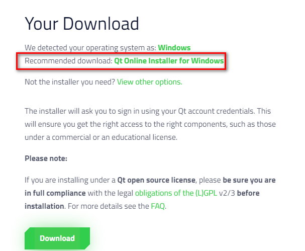

If the installation of the binaries will be carried out using the online installer, then an account from the qt-creator website will be required. Therefore, take care of this in advance.


In order not to suffer with registration and / or bypassing a ridiculous IP blocker, you can do the following:
- download the offline installer from the link above (you can use the direct link and use a third-party downloader https://mirror.netcologne.de/qtproject/archive/qt/5.12/5.12.12/qt-opensource-windows-x86-5.12.12.exe).
- disconnect your internet connection and run the installer
- then the installer allows you to immediately proceed to the installation of the necessary components


 
- set the installation directory

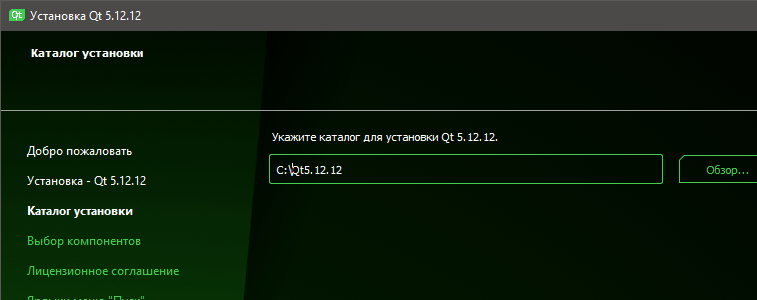


- mark in the section ***"Qt x.x.x"*** the item *"MinGWx.x.x win64"* (for x32, mark  *"MinGWx.x.x. win32"* instead) and in the section ***" Developer and Designer Tools"*** items *"MinGWx.x.x win64"* (for x32 mark *"MinGWx.x.x. win32"* instead) and *"Qt Creator x.x.x. CDB Debugger Support"*

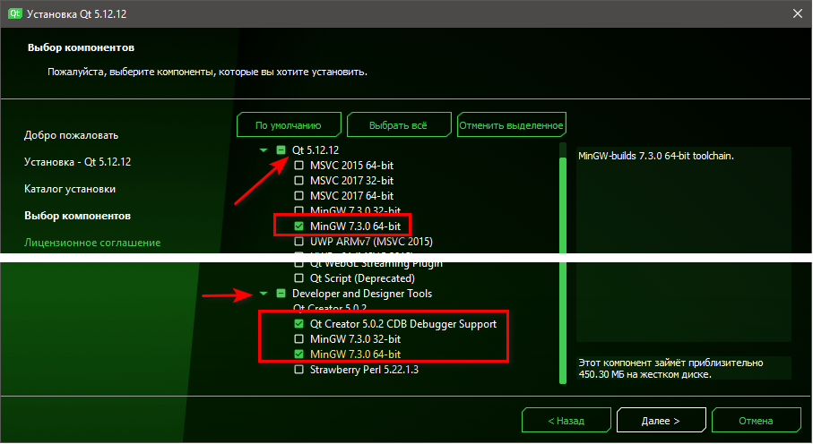

- next, install the binaries and libraries step by step, uncheck the box on the last page so as not to start Qt creator, and close the installer

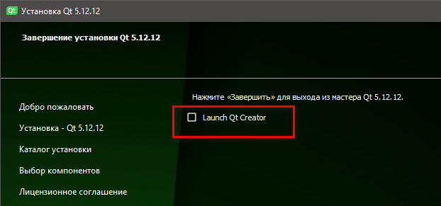


Now we have a set of binaries and libraries of the Qt framework (I have them installed here):
```bash
c:\Qt\5.12.12\mingw73_64\bin 
c:\Qt\Tools\mingw730_64\bin
c:\Qt\Tools\QtCreator\bin
c:\Qt\Tools\mingw730_64\x86_64-w64-mingw32\bin\
```

To continue working with utilities from the console, you need to add them to the environment variables either through the registry (I did this) or through the console:
```bash
set PATH=c:\Qt\5.12.12\mingw73_64\bin;c:\Qt\Tools\mingw730_64\bin;c:\Qt\Tools\QtCreator\bin;c:\Qt\Tools\mingw730_64\x86_64-w64-mingw32\bin;%PATH%
```
> ***Note:*** *if you get this message while building a dll*
```bash
Qt5Pas_resource.rc:1: windows.h: No such file or directory
windres: Qt5Pas_resource.rc:12: syntax error
windres: preprocessing failed.
mingw32-make: *** [Makefile:1463: tmp/Qt5Pas_resource_res.o] Error 1
```

> *this means, most likely, that the *windres.exe* utility is used ***not*** from the set installed by Qt (I have it here c:\Qt\Tools\mingw730_64\bin), but from another directory (e.g. , the gnu compiler directory *fpc.exe*/*ppcx.exe* also contains this file). This should be taken into account when specifying the order of the paths. This determines where the compiler will first look for this utility.*


So, we will assume that all preliminary preparation is completed (you should already have the compiler and git client installed).

Download the source code of Lazarus
```bash
C:\Users\leyba>md c:\laz_qt
C:\Users\leyba>cd c:\laz_qt
c:\laz_qt>git clone https://gitlab.com/freepascal.org/lazarus/lazarus.git
```
Next, go to the folder with the lazarus Qt5 source code
```bash
c:\laz_qt>cd c:\laz_qt\lazarus\lcl\interfaces\qt5\cbindings\
```

Check if all the environment variables we need are set correctly
```bash
c:\laz_qt\lazarus\lcl\interfaces\qt5\cbindings>qmake -query
QT_SYSROOT:
QT_INSTALL_PREFIX:C:/Qt/5.12.12/mingw73_64
QT_INSTALL_ARCHDATA:C:/Qt/5.12.12/mingw73_64
QT_INSTALL_DATA:C:/Qt/5.12.12/mingw73_64
QT_INSTALL_DOCS:C:/Qt/Docs/Qt-5.12.12
QT_INSTALL_HEADERS:C:/Qt/5.12.12/mingw73_64/include
QT_INSTALL_LIBS:C:/Qt/5.12.12/mingw73_64/lib
QT_INSTALL_LIBEXECS:C:/Qt/5.12.12/mingw73_64/bin
QT_INSTALL_BINS:C:/Qt/5.12.12/mingw73_64/bin
QT_INSTALL_TESTS:C:/Qt/5.12.12/mingw73_64/tests
QT_INSTALL_PLUGINS:C:/Qt/5.12.12/mingw73_64/plugins
QT_INSTALL_IMPORTS:C:/Qt/5.12.12/mingw73_64/imports
QT_INSTALL_QML:C:/Qt/5.12.12/mingw73_64/qml
QT_INSTALL_TRANSLATIONS:C:/Qt/5.12.12/mingw73_64/translations
QT_INSTALL_CONFIGURATION:
QT_INSTALL_EXAMPLES:C:/Qt/Examples/Qt-5.12.12
QT_INSTALL_DEMOS:C:/Qt/Examples/Qt-5.12.12
QT_HOST_PREFIX:C:/Qt/5.12.12/mingw73_64
QT_HOST_DATA:C:/Qt/5.12.12/mingw73_64
QT_HOST_BINS:C:/Qt/5.12.12/mingw73_64/bin
QT_HOST_LIBS:C:/Qt/5.12.12/mingw73_64/lib
QMAKE_SPEC:win32-g++
QMAKE_XSPEC:win32-g++
QMAKE_VERSION:3.1
QT_VERSION:5.12.12
```

If the output ends with any error, then you need to revise the paths and redefine them.
 
If we get the output shown above, then we proceed to create *Makefile* with the build script:
```bash
c:\laz_qt\lazarus\lcl\interfaces\qt5\cbindings>qmake
Info: creating stash file C:\laz_qt\lazarus\lcl\interfaces\qt5\cbindings\.qmake.stash
Project MESSAGE: Note: This binding version was generated for Qt 5.6.1. Current Qt is 5.12.12
Project MESSAGE: Qt documents binary compatibility in each Version Change Note: http://qt.nokia.com/developer/changes
Project MESSAGE: Pascal Qt Interface for binding platform: MSWINDOWS
Project MESSAGE: Install location: C:/Qt5/5.12.12/mingw73_64/bin
```

Now we can start building the Qt5 library. We start a long process:
```bash
c:\laz_qt\lazarus\lcl\interfaces\qt5\cbindings>mingw32-make
```
Let's go get some coffee... :)

The result will be the creation of ***Qt5Pas1.dll*** in the same directory as ***qt5.pas***, which is needed to build the same.

In order not to copy files to the lazarus root directory, add this folder to the path (in the registry or in the console) as described above.

Now proceed directly to the assembly of Lazarus
```bash
c:\laz_qt\lazarus\lcl\interfaces\qt5\cbindings>cd c:\laz_qt\lazarus
c:\laz_qt\lazarus> make clean all bigide LCL_PLATFORM=qt5
```


****
>***Note:*** if you have build a fpc with a separate config into a separate folder (e.g., using **fpcupdeluxe**), then you can use the following script
```bash
set root_dir=c:\laz_qt
set fpc_bin_dir=%root_dir%\fpc\bin\x86_64-win64
set make_bin_dir=%root_dir%\fpcbootstrap

#clean
%make_bin_dir%\make.exe FPC=%fpc_bin_dir%\fpc.exe PP=%fpc_bin_dir%\ppcx64.exe PREFIX=%root_dir%\lazarus INSTALL_PREFIX=%root_dir%\lazarus LAZARUS_INSTALL_DIR=%root_dir%\lazarus\ UPXPROG=echo OS_SOURCE=win64 CPU_SOURCE=x86_64 OS_TARGET=win64 CPU_TARGET=x86_64 --directory=%root_dir%\lazarus distclean

#build
%make_bin_dir%\make.exe --directory=%root_dir%\lazarus FPC=%fpc_bin_dir%\fpc.exe PP=%fpc_bin_dir%\ppcx64.exe USESVN2REVISIONINC=0 PREFIX=%root_dir%\lazarus INSTALL_PREFIX=%root_dir%\lazarus LAZARUS_INSTALL_DIR=%root_dir%\lazarus\ FPCDIR=%root_dir%\fpcsrc FPCMAKE=%fpc_bin_dir%\fpcmake.exe PPUMOVE=%fpc_bin_dir%\ppumove.exe UPXPROG=echo OPT=-vw-n-h-l-d-u-t-p-c- lazbuild

# install qt5
%make_bin_dir%\make --directory=%root_dir%\lazarus FPC=%fpc_bin_dir%\fpc.exe PP=%fpc_bin_dir%\ppcx64.exe USESVN2REVISIONINC=0 PREFIX=%root_dir%\lazarus INSTALL_PREFIX=%root_dir%\lazarus LAZARUS_INSTALL_DIR=%root_dir%\lazarus FPCDIR=%root_dir%\fpcsrc FPCMAKE=%fpc_bin_dir%\fpcmake.exe PPUMOVE=%fpc_bin_dir%\ppumove.exe OPT=-vw-n-h-l-d-u-t-p-c- bigide LCL_PLATFORM=qt5
```
****

As a result, we get Lazarus with qt interface

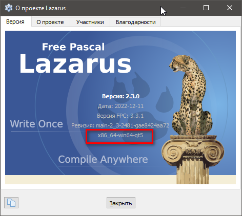


#### Linux <a name="qt_lazarus_linux"></a>

Building lazarus-qt for Linux is easiest if the desktop environment is KDE Plasma (e.g, it comes with Debian, Kubuntu, Open SUSE). Installation on Linux is much easier than on Windows.

I'll use the Debian-like Kubuntu OS to describe the process.

 We will assume that you already have the compiler and git installed.

Download the Lazarus source code and go to the folder with qt5
```bash
$: md ~/laz_qt
$: cd ~/laz_qt
$: git clone https://gitlab.com/freepascal.org/lazarus/lazarus.git
$: cd ~/laz_qt/lazarus/lcl/interfaces/qt5/cbindings
```
Check if we have the necessary packages installed:
```bash
$: qmake -query
```
If we receive a message
```bash
bash: qmake: command not found
```
so we do not have this package and we need to install it:
```bash
$: sudo apt install qt5-qmake
```

Again we try to run the qt compiler:
```bash
$:qmake
```

If we get an error:
```bash
"Project ERROR: Unknown module(s) in QT: core gui network printsupport x11extras"
```
so we are missing a few more qt-modules. We look at the sign (taken from [here](https://webhamster.ru/mytetrashare/index/mtb0/1620975455yvmf403xxv)):

|Qt module|dev package|lib package|
|------|------|------|
|bluetooth|qtconnectivity5-dev|libqt5bluetooth5|
|concurrent|qtbase5-dev|libqt5concurrent5|
|connectivity|qtmobility-dev|libqtconnectivity1|
|contacts|qtmobility-dev|libqt5contacts5|
|core|qtbase5-dev|libqt5core5a|
|dbus|qtbase5-dev|libqt5dbus5|
|designer|qttools5-dev|libqt5designer5|
|designercomponents|qttools5-dev|libqt5designercomponents5|
|feedback|qtmobility-dev|libqt5feedback5|
|gallery|qtmobility-dev|libqtgallery1|
|gui|qtbase5-dev|libqt5gui5|
|help|qttools5-dev|libqt5help5|
|location|qtmobility-dev|libqt5location5|
|multimedia|qtmultimedia5-dev|libqt5multimedia5|
|multimediakit|qtmobility-dev|libqtmultimediakit1|
|network|qtbase5-dev|libqt5network5|
|networkauth|libqt5networkauth5-dev|libqt5networkauth5|
|nfc|qtconnectivity5-dev|libqt5nfc5|
|opengl|libqt5opengl5-dev|libqt5opengl5|
|organizer|qtmobility-dev|libqt5organizer5|
|positioning|qtpositioning5-dev|libqt5positioning5|
|printsupport|qtbase5-dev|libqt5printsupport5|
|publishsubscribe|qtmobility-dev|libqt5publishsubscribe5|
|qml|qtdeclarative5-dev|libqt5qml5|
|quick|qtdeclarative5-dev|libqt5quick5|
|quickparticles|qtdeclarative5-dev|libqt5quickparticles5|
|quicktest|qtdeclarative5-dev|libqt5quicktest5|
|quickwidgets|qtdeclarative5-dev|libqt5quickwidgets5|
|script|qtscript5-dev|libqt5script5|
|scripttools|qtscript5-dev|libqt5scripttools5|
|sensors|qtmobility-dev, libqt5sensors5-dev|libqt5sensors5|
|serialport|libqt5serialport5-dev|libqt5serialport5|
|serviceframework|qtmobility-dev|libqt5serviceframework5|
|sql|qtbase5-dev|libqt5sql5|
|svg|libqt5svg5-dev|libqt5svg5|
|systeminfo|qtmobility-dev|libqt5systeminfo5|
|test|qtbase5-dev|libqt5test5|
|uitools|qttools5-dev|?|
|versit|qtmobility-dev|libqtversit1|
|webchannel|?|?|
|webkit|libqt5webkit5-dev|libqt5webkit5|
|websockets|libqt5websockets5-dev|libqt5websockets5|
|widgets|qtbase5-dev|libqt5widgets5|
|x11extras|libqt5x11extras5-dev|libqt5x11extras5|
|xml|qtbase5-dev|libqt5xml5|
|xmlpatterns|libqt5xmlpatterns5-dev|libqt5xmlpatterns5|

In our case, these are modules:
- core (qtbase5-dev)
- gui (qtbase5-dev)
- network (qtbase5-dev)
- printsupport (qtbase5-dev)
- x11extras (libqt5x11extras5-dev)

They are located in the *qtbase5-dev* and *libqt5x11extras5-dev* packages. We put them:
```bash
$: sudo apt install qtbase5-dev libqt5x11extras5-dev
```

Now let's try again:
```bash
$: qmake

Project MESSAGE: Note: This binding version was generated for Qt 5.6.1. Current Qt is 5.15.3
Project MESSAGE: Qt documents binary compatibility in each Version Change Note: http://qt.nokia.com/developer/changes
Project MESSAGE: Adding x11extras for XOrg platform.
Project MESSAGE: Pascal Qt Interface for binding platform: BINUX
Project MESSAGE: Install location: /usr/lib/x86_64-linux-gnu
```
The result of this will be the creation of a Makefile. 

Now we are trying to build the libraries
```bash
$: make
```
If we receive a message:
```bash
make: *** No targets specified and no makefile found.  Stop.
```
it means that we have already built the libQt5Pas libraries. If it is necessary to rebuild from, then we do:
```bash
$: make clean
$: make
```

If everything is in order, then the long process of compiling libraries will begin, which will end with the output:
```bash
ln -s libQt5Pas.so.1.2.10 libQt5Pas.so
ln -s libQt5Pas.so.1.2.10 libQt5Pas.so.1
ln -s libQt5Pas.so.1.2.10 libQt5Pas.so.1.2
```

Now you can install them in system directories
```bash
$: sudo make install

/usr/lib/qt5/bin/qmake -install qinstall -exe libQt5Pas.so.1.2.10 /usr/lib/x86_64-linux-gnu/libQt5Pas.so.1.2.10
strip --strip-unneeded /usr/lib/x86_64-linux-gnu/libQt5Pas.so.1.2.10
ln -f -s libQt5Pas.so.1.2.10 /usr/lib/x86_64-linux-gnu/libQt5Pas.so
ln -f -s libQt5Pas.so.1.2.10 /usr/lib/x86_64-linux-gnu/libQt5Pas.so.1
ln -f -s libQt5Pas.so.1.2.10 /usr/lib/x86_64-linux-gnu/libQt5Pas.so.1.2
```

And finally we will try to build Lazarus 
```bash
$: cd ~/laz_qt/lazarus
$: make bigide LCL_PLATFORM=qt5
```

> *Note*: if you installed the compiler using fpcupdeluxe, you need to specify the path to the fpc.sh file in the command line. Thus, the line in the terminal will look something like this:
```bash
$: make bigide FPC="<full-path-to-the-folder-with-fpc.sh>" LCL_PLATFORM=qt5
```

And here is the expected result:

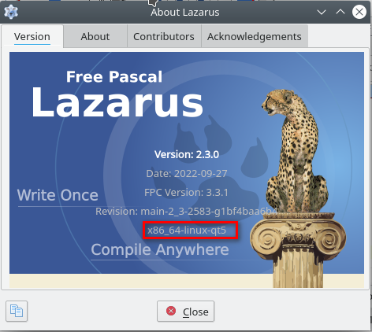


## Cross compilation to FPC <a name="crosscompilling_fpc"></a>


### Installing the crosscompiler <a name="crosscompiler_install"></a>

We will assume that the compiler and lazarus are already installed using [fpcupdeluxe](https://github.com/LongDirtyAnimAlf/fpcupdeluxe/releases) and the "set install path" field contains the folder with installed fpc / lazarus

Go to the "cross" tab


Select the bitness of the processor and the OS.

> *Note*: you can build a crosscompiler for a processor of a different bit capacity on the current platform. The main thing to remember is what bit depth you have running fpcupdeluxe (oftthe sware shown on the screenshot collects a 64-bit fpc for Windows, which means that the x32/i386 compiler assembly will be the "cross-platform" for Windows, etc.)

#### Windows <a name="crosscompiler_install_win"></a>

Select `CPU = i386` and ` OS = Windows` respectively, and click "Install compiler". Say "Yes" to both dialogues

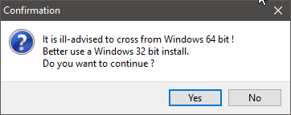 

The x32 compiler should build easily without any additional hassle.

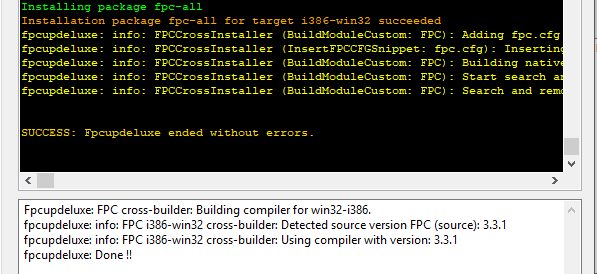

> *Note*: how to make the build mode of the executable file under x32, see [next chapter](#Build-modes-for-cross-compiler).

#### Linux <a name="crosscompiler_install_linux"></a>

Since the assemblies of the crosscompiler for i386 and amd64 are identical, I will describe the process for the last listed one.

Select `CPU=x86_64` and ` OS=linux` respectively, and click "Install compiler". Say "Yes" to both dialogues

  

and wait until the utility informs us that it does not currently have a tool for building the crosscompiler. Then she will offer to download them


If we agree, we will be able to observe the process of downloading and unpacking


Then we patiently wait for building end.

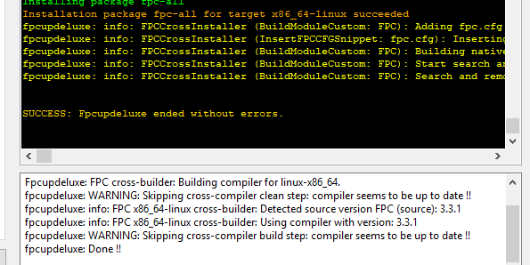

> *Note*: how to make the build mode of the executable file under i386/amd64, see [next chapter](#Build-modes-for-cross-compiler).

#### Darwin <a name="crosscompiler_install_darwin"></a>

Since for testing my projects under MacOS I use its hackintosh assemblies in a virtual machine that use an x86_64 processor, here I will describe the process of building a crosscompiler of this architecture.

Select `CPU=x86_64` and ` OS=Darwin` respectively, and click "Install compiler". Say "Yes" to both dialogues

 

and wait until the utility informs us that it does not currently have a tool for building the crosscompiler. Then she will offer to download them

 

If we agree, we will be able to observe the process of downloading and unpacking

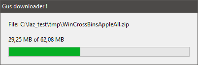

Then we patiently wait for building end.


> *Note*: how to make the build mode of the executable file under x86-64, see [next chapter](#Build-modes-for-cross-compiler).

### Build modes for cross compiler <a name="crosscompilling_build_mode"></a>

To build executable files for different platforms using the cross compiler(s), you need to configure the appropriate build modes in your project. To do this, open your project by Lazarus and open the project properties


In the tree that opens, find "Compiler options" item and proceed to setting the "Build modes" by clicking on the button with the ellipsis

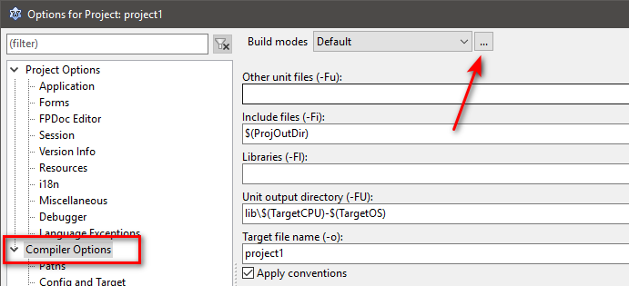

By default, Lazarus has one build mode ("Default"), which builds an executable file with debug information.

> *In this case, the executable file in the "Default" mode will correspond to the bitness of the compiler (as we remember from the previous chapter, the bitness of the compiler will correspond to the bitness of fpcupdeluxe, with which it was builded).*

 

Click on the "Create Debug and Release modes" button to create separate debug and release modes.

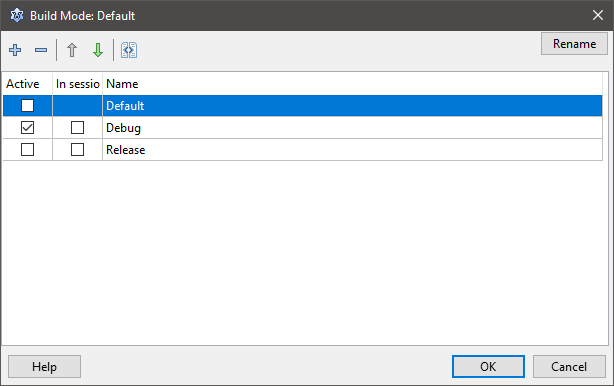

Now you can delete the "Default" mode and add a couple of more release modes for our needs, remembering to rename them accordingly


Now close the window and set up your modes.

Go to the settings tree to the "Config and Target" item


Sequentially selecting the specified build modes in the "Build modes" drop-down list, set the appropriate settings for each of them:

| Mode                 | OS     | CPU    | Note                                                                       |
| -------------------- | ------ | ------ | -------------------------------------------------------------------------- |
| Debug                |        |        | do not change the default settings! (if only you are sure of your actions) |
| Release_win32        | win32  | i386   | Don't uncheck the "Win32 GUI application" checkbox!                        |
| Release_win64        | win64  | x86_64 | Don't uncheck the "Win32 GUI application" checkbox!                        |
| Release_linux_i386   | Linux  | i386   | Don't uncheck the "Win32 GUI application" checkbox!                        |
| Release_linux_amd64  | Linux  | x86_64 | Don't uncheck the "Win32 GUI application" checkbox!                        |
| Release_Darwin_Cocoa | Darwin | x86_64 | Be sure to uncheck "Win32 GUI application"! See note                       |

> *Note*: since each OS uses different widgetsets to display controls on the form(s), then for "my" MacOS (I wrote that I use Darwin with Cocoa widgets in the [previous chapter](#Darwin)) additional settings.

It is necessary to uncheck "Win32 GUI application"


and click to link "Select another widgetset" (or go to "Additions and Overrides" item in the project tree)

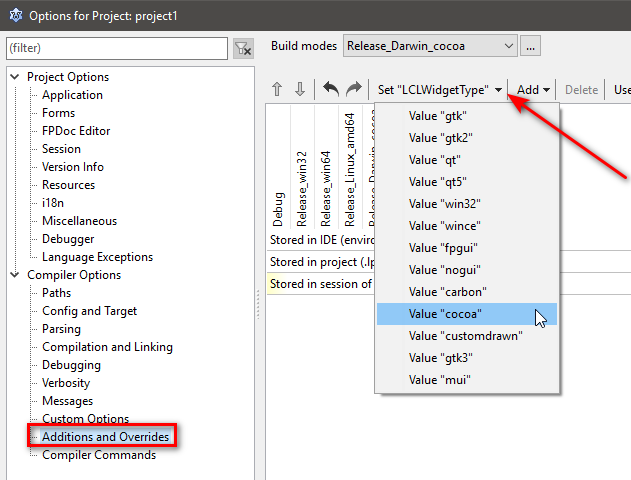 

Select the "Value "Cocoa" item in the "SetLCLWidgetType" drop-down list, and make sure that there is a check mark next to this build mode.

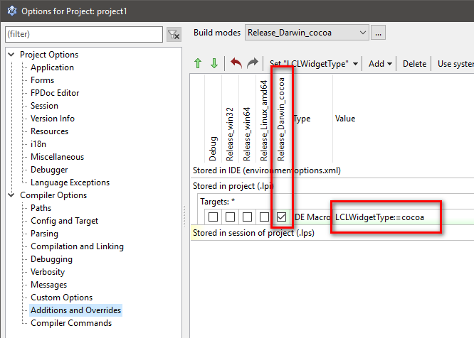

and close the dialog.

If you start building a project in different modes, then all executable files will be compiled under the same name and in the same folder and sometimes will differ only in extension. To avoid this, I make a few more changes to the project properties using IDE macros.

For debug mode, I specify the value for the output file (the "Target file name" field): `debug\$NameOnly($(ProjFile))-debug`


and for "release" assemblies, I set the value: `release\$NameOnly($(ProjFile))-$(TargetCPU)-$(TargetOS)`

Let's say my project file is named "fbutil_wrapper.lpi". Then the finished files get the following names

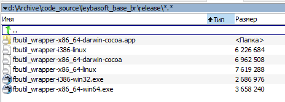

### Building process of applications via a crosscompiler <a name="crosscompilling_building"></a>

To quickly select the build mode, you can use the toolbar or the corresponding menu item. You can build files individually or build all in one pass

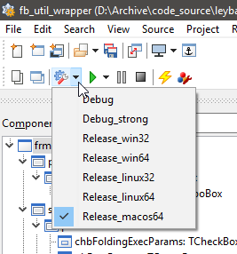   

> **An important point(!)**: if the building process is for another platform, then you cannot build/compile the project using `<F9>` - you will get an error about the impossibility to run the executable file. It is necessary to build/compile an executable file using (if by default) `<Shift>+<F9>`/`<Ctrl>+<F9>`.
